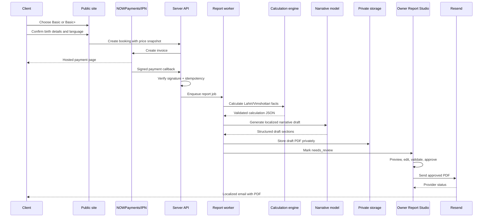

# Report Studio — архитектурная спецификация

## 1. Область и утверждённые параметры

Report Studio — owner-only модуль внутри текущего Vedic Astrology Booking. Клиент по-прежнему оформляет и оплачивает заказ на public-сайте, а расчёт, генерация и отправка подробного отчёта выполняются в защищённом server-side workflow.

| Параметр | Утверждённое значение |
|---|---|
| Зодиак | Сидерический зодиак |
| Ayanāṃśa | Lahiri |
| Dasha | Vimshottari |
| Basic | D1 / Rāśi chart |
| Basic+ | D1 + D9 / Navāṃśa |
| Языки отчёта | Русский, английский, немецкий |
| Источник фактов | Детерминированный calculation JSON |
| Роль AI | Пишет narrative draft только на основе validated JSON |
| Отправка | По умолчанию owner approval; auto-send — отдельный feature flag после испытаний |
| Стиль | Светлая самостоятельная editorial-система, вдохновлённая светлой эстетикой Parasara Light 9 без копирования proprietary UI/assets |

Цель — не создать «чёрный ящик», который выдаёт уверенно звучащий текст, а построить воспроизводимый конвейер: одинаковые подтверждённые входные данные и одинаковая версия calculation engine должны приводить к одному и тому же набору фактов.

## 2. Границы ответственности компонентов

Public-сайт отвечает за маркетинговый переход, выбор пакета, ввод birth details, согласие с условиями, создание checkout и показ payment status. Payment layer отвечает за server-side invoice creation, IPN/signature verification, replay protection и idempotent transition в confirmed payment.

Report engine отвечает только за календарные, астрономические и астрологические вычисления и возвращает typed JSON. AI narrative layer превращает validated facts в текстовые блоки, но не имеет права пересчитывать градусы, даты, знаки, дома, накшатры, dasha periods или итоговую цену. PDF renderer компилирует chart SVG/PNG, таблицы и утверждённые text blocks в версионированный документ. Delivery layer отправляет только approved artifact.

## 3. End-to-end workflow



### 3.1 State machine

The report state is independent of booking payment state. Recommended states are `waiting_payment`, `paid`, `queued`, `calculating`, `calculated`, `narrative_draft`, `rendering`, `draft_ready`, `needs_review`, `approved`, `sending`, `sent`, `rejected`, `calculation_failed`, `render_failed` and `delivery_failed`.

A booking can have only one active report job per `bookingId` and `reportVersion`, enforced by a unique idempotency key. A retry resumes or creates a new attempt without changing the original calculation snapshot. Editing narrative text creates a new report version or an immutable edit event, depending on the chosen editorial policy. Calculation facts remain read-only in the editor.

## 4. Confirmed input snapshot

At payment confirmation, copy the customer-confirmed data into an immutable `calculation_snapshots` row. Do not calculate directly from mutable `booking_requests` fields. The snapshot must include:

| Field group | Required values |
|---|---|
| Identity | Booking ID, report version, language, package type |
| Birth data | ISO local date, local time, city, country, resolved latitude/longitude |
| Time handling | IANA timezone, UTC instant, DST resolution policy, source of geocoding |
| Chart settings | Sidereal mode, Lahiri ayanāṃśa version, Vimshottari configuration, house system |
| Provenance | Input hash, confirmedAt, confirmedBy (`client`/`system`), calculation engine version |
| Quality flags | Missing/ambiguous time, low-confidence geocode, timezone ambiguity, unsupported location |

If the client changes birth details after payment, do not overwrite the snapshot. Create a new version after explicit owner action and record the before/after summary in audit history.

## 5. Deterministic calculation JSON contract

The calculation engine must return JSON that validates against a versioned schema. A simplified contract is shown below; the implementation should use Zod/JSON Schema and reject incomplete or contradictory output before AI or PDF rendering.

```json
{
  "schemaVersion": "vedic-chart-facts.v1",
  "engine": {
    "name": "approved-engine-adapter",
    "version": "x.y.z",
    "ephemerisVersion": "yyyy.mm",
    "zodiac": "sidereal",
    "ayanamsa": "lahiri",
    "dasha": "vimshottari",
    "calculatedAt": "2026-08-23T00:00:00.000Z"
  },
  "input": {
    "birthDateLocal": "YYYY-MM-DD",
    "birthTimeLocal": "HH:mm",
    "timezone": "Europe/Berlin",
    "birthInstantUtc": "YYYY-MM-DDTHH:mm:ss.sssZ",
    "latitude": 0.0,
    "longitude": 0.0,
    "qualityFlags": []
  },
  "chart": {
    "ascendant": { "sign": "...", "degree": 0.0 },
    "planets": [],
    "houses": [],
    "nakshatras": [],
    "divisionalCharts": { "D1": {}, "D9": null }
  },
  "dasha": {
    "system": "vimshottari",
    "birthNakshatraLord": "...",
    "periods": []
  },
  "derivedRules": {
    "yogas": [],
    "doshas": [],
    "strengths": [],
    "ruleSetVersion": "vedic-rules.v1"
  },
  "package": { "type": "basic", "includesD9": false },
  "integrity": { "inputHash": "sha256:...", "factsHash": "sha256:..." }
}
```

Для Basic `divisionalCharts.D9` должен быть `null` и `includesD9` — `false`. Для Basic+ D9 рассчитывается тем же engine version и помещается в отдельный namespace. Сырые расчётные значения не должны быть округлены раньше, чем это разрешено chart specification; display rounding выполняется только на PDF-слое.

## 6. AI narrative contract

AI получает только validated calculation JSON, локаль, template version и список разрешённых разделов. Не передавайте в prompt email, payment ID, internal notes или лишние личные данные. Модель должна вернуть structured JSON, а не произвольный Markdown:

```json
{
  "schemaVersion": "vedic-narrative.v1",
  "locale": "ru",
  "sections": [
    {
      "sectionKey": "lagna-and-core-themes",
      "title": "Лагна и основные акценты",
      "paragraphs": ["..."],
      "factRefs": ["chart.ascendant", "chart.planets[0]"],
      "warnings": []
    }
  ],
  "disclaimerKey": "interpretive-practice",
  "modelVersion": "...",
  "promptVersion": "..."
}
```

Server-side validators должны блокировать narrative, если отсутствуют required sections, превышены limits, появились неподдерживаемые medical/legal/financial claims или `factRefs` ссылаются на отсутствующие поля. AI-текст имеет статус `draft` до owner approval. Editor может редактировать только narrative, headings and formatting; chart facts and dates are read-only.

## 7. Рекомендуемые таблицы БД

Ниже приведена логическая схема для Drizzle/MySQL. Существующая `booking_requests` остаётся источником заказа и payment state, но report module не должен хранить всё состояние в ней.

### 7.1 `report_jobs`

| Поле | Тип | Правило |
|---|---|---|
| `id` | BIGINT PK | Внутренний идентификатор |
| `bookingId` | INT NOT NULL | Логическая ссылка на `booking_requests.id`, index |
| `reportVersion` | INT NOT NULL | Начинается с 1 |
| `packageType` | ENUM(`basic`,`basic_plus`) | Snapshot package |
| `language` | VARCHAR(8) | Только `ru`, `en`, `de` в первом релизе |
| `status` | ENUM | State machine выше |
| `idempotencyKey` | VARCHAR(160) UNIQUE | `bookingId:version:inputHash:templateVersion` |
| `inputHash` | CHAR(64) | Hash immutable input snapshot |
| `factsHash` | CHAR(64) | Hash calculation JSON |
| `attemptCount` | INT | Bounded retry count |
| `lastErrorCode` | VARCHAR(64) NULL | Safe machine-readable code |
| `lastErrorMessage` | VARCHAR(1000) NULL | No secrets/PII |
| `queuedAt` | TIMESTAMP NULL | UTC |
| `startedAt` | TIMESTAMP NULL | UTC |
| `finishedAt` | TIMESTAMP NULL | UTC |
| `createdAt` | TIMESTAMP | UTC |
| `updatedAt` | TIMESTAMP | UTC |

Indexes: `(status, createdAt)`, `(bookingId, reportVersion)`, `(language, status)`.

### 7.2 `calculation_snapshots`

| Поле | Тип | Правило |
|---|---|---|
| `id` | BIGINT PK | |
| `reportJobId` | BIGINT NOT NULL UNIQUE | One snapshot per job version |
| `birthDateLocal` | CHAR(10) | ISO date |
| `birthTimeLocal` | CHAR(5) | Local time |
| `birthCity` | VARCHAR(160) | Encrypted or restricted access where supported |
| `birthCountry` | VARCHAR(160) | |
| `latitude` | DECIMAL(9,6) | Validated range |
| `longitude` | DECIMAL(9,6) | Validated range |
| `timezone` | VARCHAR(64) | IANA name |
| `birthInstantUtc` | TIMESTAMP | Calculated and stored |
| `chartSettingsJson` | JSON/TEXT | Lahiri/Vimshottari settings |
| `qualityFlagsJson` | JSON/TEXT | Ambiguity/warning flags |
| `inputHash` | CHAR(64) UNIQUE | Detects same calculation input |
| `confirmedAt` | TIMESTAMP | UTC |
| `createdAt` | TIMESTAMP | UTC |

Do not use a JSON blob instead of typed fields for data needed in filters, authorization or reconciliation. Typed fields support validation and indexes; JSON stores versioned engine payloads.

### 7.3 `calculation_results`

| Поле | Тип | Правило |
|---|---|---|
| `id` | BIGINT PK | |
| `reportJobId` | BIGINT NOT NULL UNIQUE | |
| `schemaVersion` | VARCHAR(32) | Contract version |
| `engineName` | VARCHAR(100) | Adapter name |
| `engineVersion` | VARCHAR(64) | Reproducibility |
| `ephemerisVersion` | VARCHAR(64) | Reproducibility |
| `factsJson` | JSON/TEXT | Validated deterministic facts |
| `factsHash` | CHAR(64) | Integrity |
| `validationStatus` | ENUM(`pending`,`valid`,`invalid`) | Gate for AI/PDF |
| `validationErrorsJson` | JSON/TEXT NULL | Safe validation details |
| `createdAt` | TIMESTAMP | UTC |

### 7.4 `narrative_drafts`

| Поле | Тип | Правило |
|---|---|---|
| `id` | BIGINT PK | |
| `reportJobId` | BIGINT NOT NULL | |
| `locale` | VARCHAR(8) | `ru`, `en`, `de` |
| `modelName` | VARCHAR(100) | |
| `modelVersion` | VARCHAR(100) | |
| `promptVersion` | VARCHAR(64) | |
| `narrativeJson` | JSON/TEXT | Structured text blocks |
| `validationStatus` | ENUM(`pending`,`valid`,`invalid`,`needs_edit`) | |
| `validationErrorsJson` | JSON/TEXT NULL | |
| `createdAt` | TIMESTAMP | UTC |
| `createdBy` | VARCHAR(64) | `system` or owner ID |

Index `(reportJobId, createdAt)`; a job may have multiple drafts after regeneration.

### 7.5 `report_versions`

| Поле | Тип | Правило |
|---|---|---|
| `id` | BIGINT PK | |
| `reportJobId` | BIGINT NOT NULL | |
| `versionNumber` | INT NOT NULL | Unique per job |
| `templateVersion` | VARCHAR(64) | PDF template |
| `locale` | VARCHAR(8) | |
| `pdfStorageKey` | VARCHAR(512) NULL | Private storage only |
| `pdfSha256` | CHAR(64) NULL | Integrity |
| `status` | ENUM(`draft`,`needs_review`,`approved`,`superseded`,`sent`,`rejected`) | |
| `editorSummary` | VARCHAR(1000) NULL | No full PII |
| `approvedAt` | TIMESTAMP NULL | UTC |
| `approvedBy` | VARCHAR(64) NULL | Owner OpenID |
| `createdAt` | TIMESTAMP | UTC |

Unique key `(reportJobId, versionNumber)`, indexes `(status, createdAt)` and `(pdfSha256)`.

### 7.6 `report_sections`

| Поле | Тип | Правило |
|---|---|---|
| `id` | BIGINT PK | |
| `reportVersionId` | BIGINT NOT NULL | |
| `sectionKey` | VARCHAR(100) | Stable renderer key |
| `sortOrder` | INT | |
| `sourceFactsJson` | JSON/TEXT | Fact references, not duplicated private identity |
| `draftText` | TEXT | AI draft |
| `approvedText` | TEXT NULL | Owner-approved text |
| `editedBy` | VARCHAR(64) NULL | Owner OpenID |
| `editedAt` | TIMESTAMP NULL | UTC |
| `createdAt` | TIMESTAMP | UTC |

Unique key `(reportVersionId, sectionKey)`.

### 7.7 `report_delivery_attempts`

| Поле | Тип | Правило |
|---|---|---|
| `id` | BIGINT PK | |
| `reportVersionId` | BIGINT NOT NULL | Only approved version may send |
| `recipientEmail` | VARCHAR(320) | Normalized |
| `status` | ENUM(`queued`,`sending`,`sent`,`failed`,`cancelled`) | |
| `provider` | VARCHAR(40) | `resend` |
| `providerMessageId` | VARCHAR(160) NULL | |
| `idempotencyKey` | VARCHAR(180) UNIQUE | Prevent duplicate delivery |
| `errorCode` | VARCHAR(64) NULL | |
| `errorMessage` | VARCHAR(1000) NULL | Truncated/no secrets |
| `requestedBy` | VARCHAR(64) | Owner/system |
| `requestedAt` | TIMESTAMP | UTC |
| `completedAt` | TIMESTAMP NULL | UTC |

### 7.8 `report_audit_events`

| Поле | Тип | Правило |
|---|---|---|
| `id` | BIGINT PK | |
| `reportJobId` | BIGINT NOT NULL | |
| `eventType` | VARCHAR(80) | e.g. `facts_validated`, `pdf_approved` |
| `actorType` | ENUM(`system`,`owner`,`client`) | |
| `actorId` | VARCHAR(64) NULL | Owner OpenID or null |
| `fromStatus` | VARCHAR(40) NULL | |
| `toStatus` | VARCHAR(40) NULL | |
| `metadataJson` | JSON/TEXT NULL | Redacted summary |
| `createdAt` | TIMESTAMP | UTC |

Index `(reportJobId, createdAt)` and `(eventType, createdAt)`.

### 7.9 Optional future tables

`report_templates` stores versioned template metadata and allowed sections. `campaign_attribution` stores UTM/campaign identifiers without adding tracking data to the astrology facts. `report_data_requests` supports owner-reviewed correction/export/deletion requests. `job_attempts` becomes useful when a managed queue is introduced and should include provider job ID, attempt number and safe failure code.

## 8. Drizzle implementation notes

Create schema changes in `drizzle/schema.ts`, run `pnpm drizzle-kit generate`, inspect the generated SQL, and apply it with the project database migration workflow. Use explicit foreign keys only after verifying the current production database and migration conventions; otherwise enforce logical references in helpers first and add constraints in a controlled migration.

Add helpers in a dedicated `server/report-studio-db.ts` rather than growing `server/db.ts` indefinitely. Add procedures under a dedicated `server/routers/report-studio.ts` if the current router exceeds its maintainability limit. Public procedures should expose only booking submission/status. All calculation, preview, edit, approval, regeneration and delivery procedures use `adminProcedure` and check `OWNER_OPEN_ID`.

## 9. API contracts

Recommended owner-only tRPC procedures are `reportStudio.queue`, `reportStudio.getJob`, `reportStudio.getVersion`, `reportStudio.regenerateNarrative`, `reportStudio.renderPreview`, `reportStudio.updateSection`, `reportStudio.validate`, `reportStudio.approve`, `reportStudio.reject`, `reportStudio.send`, `reportStudio.retryDelivery` and `reportStudio.audit`.

Recommended public/internal server procedures are `booking.submit` with price snapshot, `payment.ipn` with verified callback handling, and an internal worker entrypoint that is not exposed as a public tRPC mutation. The worker must authenticate through an internal secret or platform scheduler identity and must be idempotent.

## 10. Acceptance criteria

A report job is ready for controlled rollout only when the following conditions hold:

| Area | Acceptance test |
|---|---|
| Payment gate | No report job is created by frontend redirect or unverified callback |
| Reproducibility | Same input hash/engine/ephemeris produces the same facts hash |
| Basic | D1 is present and D9 is absent |
| Basic+ | D1 and D9 are present and visibly labeled |
| AI safety | Narrative cannot introduce unreferenced chart facts or prohibited professional claims |
| PDF | Text is selectable, Unicode fonts render RU/EN/DE, tables do not overflow, pages are numbered |
| Approval | Only owner can change status to approved or send |
| Delivery | Only approved version can be sent; repeated click is idempotent |
| Privacy | No birth details in analytics or unredacted logs; private storage uses expiring access |
| Failure handling | Calculation/render/email errors are retryable and visible to owner |
| Retention | Raw input, draft, approved PDF and delivery metadata follow separate policies |
| Rollback | Template and engine versions can be pinned to a previous known-good release |

## 11. Implementation order

First freeze the schemas and calculation JSON contract. Then build a deterministic engine adapter with a small set of reviewed reference charts. Next add payment-to-job orchestration and idempotency. Then create the PDF renderer and visual template. After that add AI narrative generation with validation, followed by Report Studio editing and approval. Only after manual approval has operated reliably should an auto-send feature flag be considered.

The initial production mode must be `owner_approval`. The customer should receive a payment confirmation and an approximate processing message, not the report itself, until the owner approves the artifact.
